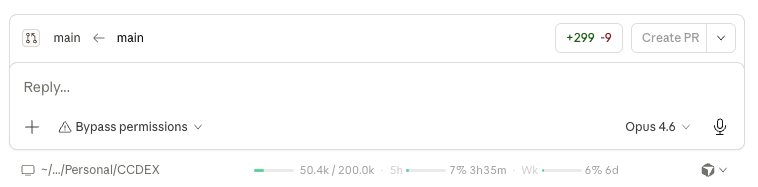

# CCDEX

**Claude Code Desktop Context Extension** — Injects a real-time context usage + rate limit indicator into Claude Desktop's footer bar.

<p align="center">
  
</p>

## What It Shows

- **Context window usage** — progress bar + token count (e.g., `46.7k / 200.0k`)
- **5-hour rate limit** — usage % + reset countdown (e.g., `5h 4% 4h30m`)
- **Weekly rate limit** — usage % + reset countdown (e.g., `Wk 6% 6d`)

Color coding: green (< 50%) / amber (50–80%) / red (> 80%).

## How It Works

CCDEX patches Claude Desktop's Electron app to inject a small script into the preload layer. The script collects two types of data:

### Context Token Usage

The Code tab communicates with the backend via Electron IPC. The script listens on the `LocalSessions` IPC channel for assistant message events, which include a `usage` object with `input_tokens`, `output_tokens`, and cache token counts. These are tracked per-session and displayed against the model's context limit.

### Rate Limit Usage

The Code tab's renderer loads from `https://claude.ai/claude-code-desktop/...`. This means `fetch('/api/...')` calls are **same-origin requests** — the browser automatically includes the `sessionKey` cookie for authentication. No API keys, no Keychain access, no manual token extraction needed.

The script reads the org ID from the `lastActiveOrg` cookie, then fetches `GET /api/organizations/{orgId}/usage` which returns utilization percentages (0–100) and reset timestamps for both 5-hour and 7-day windows.

> **Why this matters:** External tools that want rate limit data must manually extract the `sessionKey` cookie from the browser. Because CCDEX runs *inside* the renderer process, authentication is automatic and zero-config.

### UI Injection

The indicator is injected into the footer bar's `flex-1` spacer element (between the path display and action buttons). A `MutationObserver` re-injects on DOM rebuilds caused by tab switches or navigation.

## Requirements

- macOS
- [Claude Desktop](https://claude.ai/download) app
- Python 3
- Node.js (for `npx`)

## Installation

```bash
# 1. Close Claude Desktop

# 2. Disable ASAR integrity fuse (first time only, or after app updates)
npx @electron/fuses@1.8.0 write \
  --app "/Applications/Claude.app" \
  EnableEmbeddedAsarIntegrityValidation=off

# 3. Patch the ASAR
python3 patch.py

# 4. Install
cp /tmp/app-patched.asar "/Applications/Claude.app/Contents/Resources/app.asar"

# 5. Launch
open /Applications/Claude.app
```

> **Note:** `sudo` is typically not needed. Re-signing with `codesign` is not required when the ASAR integrity fuse is disabled.

## After Claude Desktop Updates

Auto-updates overwrite both `app.asar` and `Electron Framework`. Re-run all steps above.

## Project Structure

```
CCDEX/
├── README.md              # This file
├── CLAUDE.md              # Project instructions for Claude Code
├── RESEARCH.md            # Detailed technical research & architecture notes
├── context-indicator.js   # Injection script (appended to mainView.js preload)
└── patch.py               # Binary ASAR patcher
```

## How Patching Works

Electron's ASAR format includes per-file SHA256 integrity hashes, so `npx asar pack` won't work. Instead, `patch.py` does binary-level patching:

1. Parse the ASAR header (pickle format + JSON)
2. Locate `mainView.js` — read offset and size
3. Append `context-indicator.js` to the original content
4. Update the SHA256 hash and file size in the header
5. Shift offsets of all subsequent files
6. Reconstruct the binary

The `EnableEmbeddedAsarIntegrityValidation` Electron fuse must be disabled first, otherwise the app will crash on startup regardless of hash correctness.

## Debugging

Enable DevTools (survives updates):

```bash
echo '{"allowDevTools": true}' > ~/Library/Application\ Support/Claude/developer_settings.json
```

Then `Option+Cmd+I` to open DevTools. Look for `[CCDEX]` in the console.

## License

MIT
